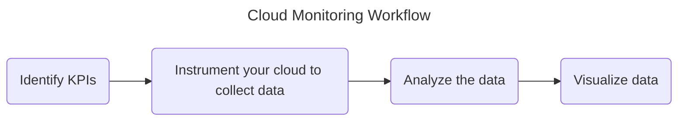

# Cloud Monitoring
**Cloud Monitoring**  
Cloud monitoring is the process of monitoring the availability and performance of cloud-based infrastructure. 

**Use Cases**  
Below is a list of use cases for logging. 
* Root Cause Analysis (RCA)
* A/B testing to make decisions
* Business Intelligence 
* User & Entity Behavior Analytics (UEBA)
* Monitoring and Alerting
* Compliance Auditing

**Availability Tests**   
Availability tests are used to check if an app is responding as expected. 

**Scaling**  
Scaling is the process of adjusting infrastructure to meet changes in demand. Workloads in production are too unpredictable for manual scaling. The Azure Monitor service provides auto-scaling.

