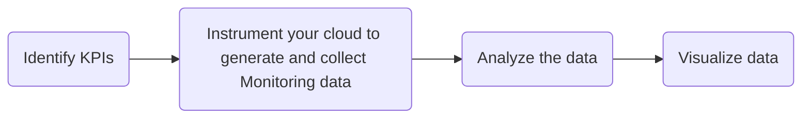

# Cloud Monitoring
Cloud monitoring is used to detect errors, failures, and changes in performance cloud-based infrastructure. Monitoring must be automated to provide 24/7 coverage. 

## Identify KPIs

## Instrument Your Cloud to Generate and Collect Monitoring Data

## Analyze the Data

## Visualize the Data

## Cloud Monitoring Stategies
**Monitor at a High-Level**  
Below are different techniques for measuring metrics at a high-level.  
* Assign qualitative labels to metrics 
* Measure the saturation point (i.e., when an app becomes unresponsive)
* Correlate metrics and determine how they relate to each other

**Monitor Using a Ticketing System**  
Below is a process for planning a ticketing system for monitoring metrics. 
1. Define what events are adverse
2. Define what is urgent, non-urgent, important, and not important
3. Define the level of authority required to respond
4. Define who is able and available to respond when there is an adverse event

**Monitor Using Key Performance Indicators (KPIs)**  
Below are examples of KPIs you can monitor. 
* Time required to enter data into a form. 
* The difference between items in a catalog and number of purchases 
* Mean Time to Resolve (MTTR)