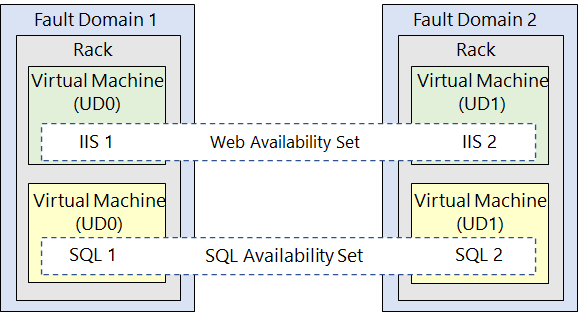

# Azure Virtual Machines
Azure Virtual Machines is a service for creating and using virtual machines. 
* [Planning Virtual Machine Configurations](#planning-virtual-machine-configurations)
* [Managed Disks](#managed-disks)
* [Vertical Scaling](#vertical-scaling)
* [Horizontal Scaling](#horizontal-scaling)
* [Availability Sets](#availability-sets)
* [Azure Bastion](#azure-bastion)

## Planning Virtual Machine Configurations
Below is a list of decisions to make when planning a new virtual machine configuration. 
* Network configuration
* Name
* Location (i.e., data center)
* Compute size and performance
* Disk size and performance
* Operating system
* Cost

### Virtual Machine Network Configurations
By default, Azure virtual machines are configured to allow inbound connections from their virtual network and all outbound connections. 

### Best Practices for Naming a Virtual Machine
Consider using the following properties in your virtual machine's name: purpose (e.g., dev, qa, prod), location (i.e., data center), instance, product/service, and role (e.g., web, chat, or security). The name of your virtual machine in Azure may also be automatically used as the hostname. Below is an example of a virtual machine name. 
```bash
# purpose: production, location: US East, instance: 001, product: SQL, role: web
prod-use-001-SQL-web
```

### Virtual Machine Costs
Virtual machines generate two bills: one for compute and one for storage. Your compute bill is based on how much you used. Your storage bill is based on how much you stored, regardless if you used or it. 

## Managed Disks
Virtual machines generally have three disks: Operating System (OS), Temporary, and Data. The OS disk is registered as a SATA drive and labeled "C:" by default. Temporary disk is used for storing page and swap files. It's labeled "D:" by default. In Linux, it's mounted as "/dev/sdb". The Data Disk is a [managed disk](/cloud/azure/offerings/storage/services/disks/README.md). It contains your user data. It's registered as a SCSI disk. 

## Vertical Scaling
Vertical scaling is when you change the **size** of a resource (e.g., virtual machine).


### Virtual Machine Compute Sizes
Below is a list of compute size categories for virtual machines. When you resize a virtual machine, you're only changing the CPU and memory allocated. Your disks remain the same. Although, the size of your virtual machine does impact how many disks you can connect.  

**General Purpose**   
CPU and memory allocation is balanced. 

**Compute Optimized**  
CPU allocation is high. This size is good for network appliances, application servers, and batch processing. 

**Memory Optimized**  
Memory allocation is high. This size is good for database servers and analytics. 

**Storage Optimized**  
Storage performance is high. This size is good for big data operations. 

**GPU**  
Designed for intense graphics rendering and/or video editing. This size is good for training ML models.  

**High Performance Computes**  
Uses the fastest CPU (high-throughput network interfaces can also be added). 

## Horizontal Scaling
Horizontal scaling is when you change the **number** of resources (e.g., virtual machines) deployed. 


### Scale Sets  
Scale sets are used to horizontally scale and load balance *identical* virtual machines. You can autoscale up to 1000 virtual machines (if the "Enable scaling beyond 100 instances" feature is enabled). If you create your own virtual machine image, the limit is 600. Virtual machines are horizontally scaled using one of two orchestration modes: flexible and uniform. 

**Flexible Orchestration Mode**  
You manually create and add a virtual machine to the scale set. 

**Uniform Orchestration Mode**  
Azure automatically creates and adds a virtual model using a model you pick. 

## Availability Sets
Availability Sets are used to separate virtual machines into update or fault domains. They're created at the same time as a virtual machine. To add a virtual machine to an availability set, you must delete it and recreate it. Mitigate single-points-of-failure in your application by separating its components (e.g., frontend, backend, and data) into separate availability sets. Availability sets can be configured to load balance across an availability set. 

### Update Domain  
An update domain is a group of virtual machines that can be updated and/or rebooted at the same time. During [planned maintenance](/cloud/azure/offerings/compute/README.md#maintenance-events), only one update domain can be rebooted at a time. You can define up to 20 update domains. 

### Fault Domain  
A vault domain is a group of virtual machines that share the same hardware (e.g., switches or cabinets).

 

## Azure Bastion
You can use SSH, RDP, or Azure Bastion to connect to a virtual machine. Azure Bastion is a proxy service for connecting to virtual machines within an Azure virtual network. If you use Azure Bastion for remote administration, your virtual machines don't need a public IP address. 

