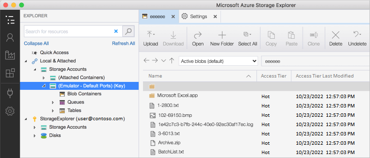
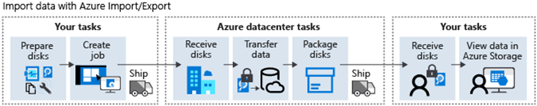

# Azure Storage
* [Storage Accounts](accounts/README.md)
* [Storage Services](services/)
* [Storage Security](#storage-security)
* [Azure Storage Explorer](#azure-storage-explorer)
* [Azure Import/Export Service](#azure-importexport-service)
* [Azure Data Box](#azure-data-box)
* [AzCopy](#azcopy)
* [Azure Migrate](#azure-migrate)

## Azure Storage Explorer
Azure Storage Explorer is a self-contained, GUI program for copying data to, from, and between storage accounts. It does not include a "cut" option. You must copy your data and then delete the original. Azure Storage Explorer can connect to multiple storage accounts (e.g., yours and someone else's) and/or services within another subscription (e.g., Blobs, Files, Queues, and Tables). Azure Storage Explorer needs an Account Key or SAS token to connect to storage in Azure. Azure Storage Explorer includes a feature called "Azure Storage Emulator" that allows you to connect to local storage. 

## Azure Import/Export Service
The Azure Import/Export Service allows you to import/export data into Azure Blobs or Azure Files using drives you own. It's meant for when you have too much data to upload over the Internet (e.g., migrations, CDNs, and diaster recovery). 

### Drive Requirements
Only internal SATA II/III HDDs or SSDs can be used with the Azure Import/Export Service. USBs and external HDDs are not supported. A single import/export job can up to 10 drives of mix type. 

### WAImportExport
The Azure Import/Export Service requires using a program called "WAImportExport" (it's only compatible with the 64-bit version of Windows). Version 1 of WAImportExport is used for Azure Blobs while Version 2 is used for Azure Files. During import and export jobs, WAImportExport creates journal files to maintain the integrity of each transfer. Import jobs also require you to encrypt every NTFS volume using WAImportExport and BitLocker. 

## Azure Data Box
The Azure Import/Export Service allows you to import or export data in Azure using appliances provided by Microsoft (e.g., Data Box Disks, Data Boxes, Data Box Heavy, and Data Box Gateway). 

## AzCopy
AzCopy is a CLI-based program for copying data to, from, and between storage accounts. AzCopy supports using Entra ID (the "Storage Blob Data Contributor" role is required) and SAS tokens for authentication. To use an SAS token, you must append it to the blob/file path in every command you enter. If a job fails, AzCopy will try it again automatically. AzCopy is included with Azure Storage Explorer and available on Windows, Linux, and macOS. 

## Azure Migrate
Azure Migrate is a service used for migrating on-prem data into Azure. It includes two tools: *Discovery and Assessment* and *Server Migration*. Discovery and Assessment finds servers on-prem for Server Migration to migrate. 

