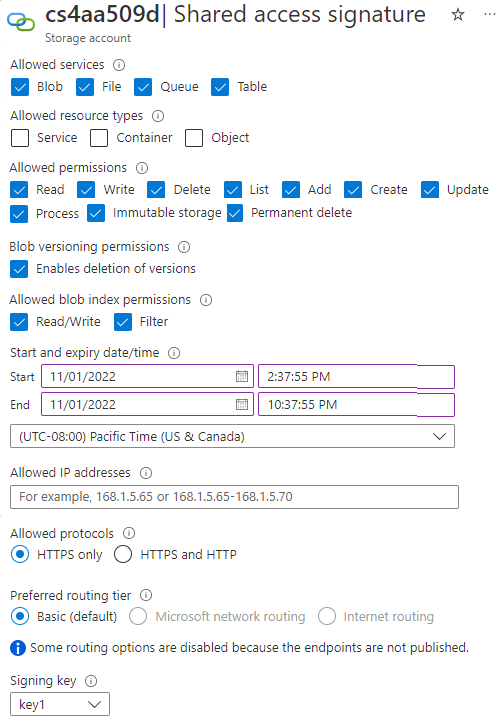

# Azure Storage Security

## Network Access
By default, "Public network access" is "Enabled from all networks." Network access can be restricted to specific virtual networks and/or IP addresses (they must be within the same region as your storage account). 

### Private Link  
Private Links allow you to use the Azure backbone connecting your storage account to Azure resources instead of the public Internet. 

## Authentication
All Azure Storage services can be configured to use Entra ID. Azure Blobs can be configured to allow anonymous entities to access containers and/or blobs. 

## Authorization
Azure Blobs, Files, Queues, and Tables use Azure RBAC. 

### Access Keys
Every storage account comes with two 512-bit access keys. They are used to digitally sign Shared Keys and/or Shared Access Signature (SAS) tokens. 

### Shared Keys
A Shared Key is an encrypted string that must be included in the Authorization Header of every Azure Storage request (i.e., you won't be able to access the storage account without including it in your request). It's used to allow an entity complete access to your storage account.

### SAS Tokens
SAS tokens are URIs. They are used to give entities access to one or more services within your storage account for a finite amount of time. They can be restricted to specific IP addresses and protocols (e.g., HTTPS). In practice, entities append SAS tokens to the URL of your storage account. Described below are some of the parameters included in a SAS token. 
* Resource URI: `blob, file, or queue`
* Storage Version: `sv=2024-01-02`
* Storage Service : `ss=bf` (Azure Blobs and Azure Files)
* Expiry Time: `se=2014-01-31` 
* Permissions: `sp=rw`
* IP Range: `sip=1.1.1.1-2.2.2.2`
* Protocol: `spr=https`
* Signature: `sig=F%6GRVAZ5Cdj2Pw4tgU7Il STkWgn7bUkkAg8P6HESXwmf%4B` (Base64 encoded HMAC signature)

**Account-Level SAS Tokens**  
Account-Level SAS tokens are used for granting access to multiple services within your Storage Account.

**Service-Level SAS Tokens**  
Service-Level SAS tokens are used for granting access to one service within your Storage Account. 

### Stored Access Policies  
Stored Access Policies are used for grouping SAS tokens for a specific service together. They make it easier to manage multiple SAS tokens. 

## Encryption
Data-at-rest is encrypted in Azure Storage using AES 256. Data-in-transit can be encrypted using HTTPS, SMB 3.0, or Client-Side Encryption. 

### Customer-Managed Encryption Keys
Data in Azure Storage can be encrypted using Microsoft-managed keys or keys you generated yourself. Keys are referenced using Azure Key Vault or a URL to where they're stored. 

