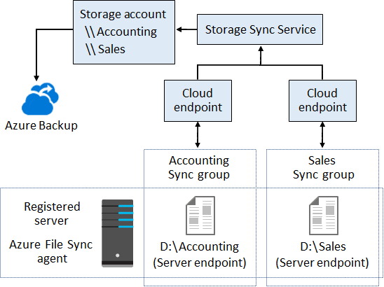
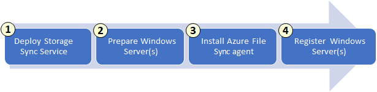

# Azure Files  
Azure Files is a service for deploying file shares in the cloud. 
* [Azure File Share Access](#azure-file-share-access)
* [Azure File Share Snapshots](#azure-file-share-snapshots)
* [Azure File Sync](#azure-file-sync)

## Azure File Share Access
Azure File Shares can be accessed using the HyperText Transfer Protocol - Secure (HTTPS), Network File System (NFS), or Server Message Block (SMB) protocol. Accessing an Azure File Share via SMB requires firewalls to traffic to and from TCP port 445. Files are made available after the Azure File Share has been mounted.

## Azure File Share Snapshots
Azure Files can take snapshots at the share-level. Only the data most recently changed data is included in the snapshot. Taking incremental snapshots like this saves time and money. Individual files can be extracted from a snapshot. You must delete all snapshots of an Azure File Share before deleting the share itself. 

**Use Cases**  
Azure File Share snapshots are useful when you're about to deploy a change, you accidentally deleted something, and in the event of audit or diaster. 

## Azure File Sync
Azure File Sync is a service that allows cloud-based virtual machines or on-prem servers to cache Azure File Shares. It's useful for lift-and-shift migrations, branch offices, file archiving, and diaster recovery. For example, if you have a branch office with limited bandwidth, you could (1) host a file share on a local machine, (2) install the Azure File Sync Agent on it, and (3) connect everyone in the branch office to the local file share. The machine with the file share will be the only one using bandwidth to download or upload files in Azure. Azure File Sync consists of four components: Storage Sync Service, Sync Group, Registered Server, and Azure File Sync Agent. Azure File Sync also includes a feature called "Cloud Tiering."

**Cloud Tiering**  
Cloud Tiering is used to cache frequently-accessed files locally and keep the rest in the cloud. Tiered files are files stored in Azure because they're not accessed often. They are replaced with a *reparse point* (i.e., URL) pointing to their real location in Azure. Tiered files have grey icons and an "offline" file attribute. 

### Storage Sync Service
The Storage Sync Service is a "peer" of your storage account and deployed in a similar manner. It syncs with multiple storage accounts. A subscription can have multiple Storage Sync Service resources. 

### Sync Group
A Sync Group represents the set of files you want to keep in sync. 

**Cloud Endpoint**  
Cloud Endpoints represents an Azure File Share within a Sync Group. Azure File Shares can only be part of one Sync Group at a time. When you add an Azure File Share to a Sync Group, the files it contains are synced to all endpoints within the group (overwriting the current state). 

### Registered Server
A Registered Server represents the "trust" between your on-prem server/cluster and Storage Sync Service. If it does not exist, your on-prem server does not trust your Storage Sync resource. A Registered Server can only be registered with one Storage Sync Service resource a time. 

**Server Endpoint** 
Server Endpoints represent where the synced files are located on the Registered Server. 

### Azure File Sync Agent
The Azure File Sync Agent is the software that allows your on-prem server to sync with an Azure File Share. It includes the files listed below.
* FileSyncSvc.exe: monitors for local changes and initiates sync sessions with Azure
* StorageSync.sys: implements cloud tiering if it's enabled
* PowerShell cmdlets for interacting with the "Microsoft.StorageSync" resource provider in Azure

