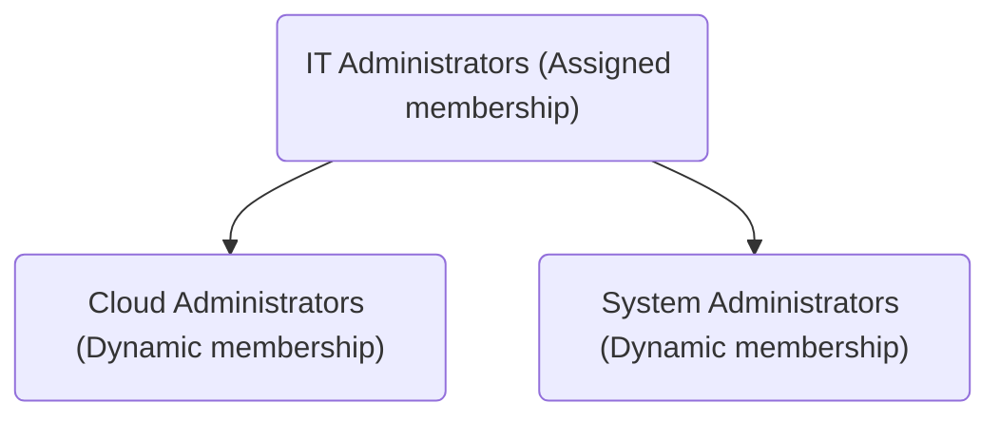

# Entra ID
Entra ID is a directory and identity management service for on-prem, Microsoft 365, and Azure-based resources. It's queried using a REST API via HTTPS, not LDAP. Also, Entra ID does not require you to specify a region.

## Entra ID Concepts
Entra ID uses the concepts described below. 

### Identity  
An identity is the representation of a person, program, or machine.

### Account  
An account is an identity with data associated to it. Entra ID supports three types of accounts: Cloud Identity, Directory-Synced Identity, and Guest Users. An account must have a Display Name and User Principal Name (UPN). Take Elliot Alderson for example. His Display Name would be "Alderson, Elliot" and his UPN would be "elliot.alderson@evil.corp." Setting account information (e.g., display name, department, and phone number) requires Global Administrator or User Administrator privileges. There is a 30 day window to restore deleted accounts. 

**Cloud Identity**  
Accounts only defined within Entra ID are called "Cloud Identity accounts" (they only exist in Azure). They are created within your tenant. Cloud Identity accounts include administrators and users within your organization or another organization using Entra ID. 

**Directory-Synchronized Identity**  
Accounts defined within Active Directory and imported to Entra ID via [Entra Connect](/cloud/azure/services/security/directory/entra-id/entra-connect/README.md) are called "Directory-Synchronized Identity accounts." They are imported to your tenant. 

**Guest User**  
Accounts defined outside of Azure are called Guest User accounts. They are invited to your tenant. Guest User accounts originate from XBox Live, other cloud service providers, etc. 

### Roles
**Global Administrator**  
The Global Administrator role can manage users and groups and assign other administrator roles. 

**User Administrator**
The User Administrator role can manage users and groups.

### Group
Entra ID supports two types of groups: Security Groups and Microsoft 365 Groups. It also supports three different ways of assigning group membership (aka "Access Rights"): Assigned, Dynamic User, and Dynamic Device. Group membership via Dynamic Device can only be used with Security Groups. 

**Group Types**  
Entra ID supports two types of groups. 
* Security Groups: used to manage access to shared resources in Azure (e.g., web apps and databases) 
* Microsoft 365 Groups: used to manage access to shared resources in Microsoft 365 (e.g., mailboxes, calendars, and files)

**Access Rights**  
There are three different ways to assign Access Rights. Adding Dynamic User groups to an Assigned group allows you to govern multiple groups at once. For example, you can change something in "IT Administrators" and affect both the "Cloud Administrators" and "System Administrators."
* Assigned: every user has unique permissions
* Dynamic User: membership is assigned while the user meets membership requirements
* Dynamic Device: membership is assigned while the device meets membership requirements

### Administrative Unit
Administrative Units (AU) are used to organize and manage administrator privileges within Entra ID. For example, say a university has three departments: business, engineering, and medicine. Each of them would be represented as an AU that includes a role with administrative permissions. This allows them to administer their own department's resources (virtual networks, machines, etc.). 
* Managing AUs requires Global Administrator or Privileged Role Administrator privileges

### Tenant  
A tenant, aka "directory," contains the identity and authorization information of people, programs, and machines within an organization. A tenant is considered an instance of Entra ID.

### Subscription  
A subscription is a organizational unit used to manage billing. Subscriptions can only use one tenant at a time. 

## Features
Entra ID includes the user-friendly and security features listed below. 
* Single Sign-On (SSO) for on-prem (e.g., devices registered via Entra Join) and Azure-based resources
* Self-Service Password Reset (SSPR) 
* Bulk operations
* Cross-Platform: supports Windows, iOS, macOS, and Android devices
* Passwordless authentication: Windows Hello
* Multi-Factor Authentication (MFA) 
* Role-Based Access Control (RBAC)
* Entra ID Protection (Conditional Access)
* Privileged Identity Management (e.g., discover, restrict, and monitor admin access)

### Entra Join
Entra Join is a feature used to add devices to a tenant with the help of on-prem Active Directory infrastructure. Adding a device to a tenant provides the benefits listed below. 
* SSO access to on-prem and Azure-based resources (when a Domain Controller is within Line-of-Sight of a device)
* Roaming: sync user and app settings between logons
* Passwordless authentication: Windows Hello

**Registering a Device**  
Registering a device provides SSO benefits. 

**Joining a Device**  
Joining a device provides SSO benefits and enforce machine configuration requirements (e.g., via Microsoft Intune). Joining a device also allows people to use a work account instead of a personal account. 

### Self-Service Password Reset
Self-Service Password Reset (SSPR) allows users to reset their password on their own. 

**SSPR Requirements**  
Every account that requires the SSPR feature must (1) be licensed and (2) be assigned Global Administrator privileges. 

**Enabling SSPR**  
In your tenant, click "Manage > Properties > Self-service password reset enabled." It's best practice to configure accounts to use MFA if they're authorized to use the SSPR feature. 

### Bulk Operations
Accounts can be created or deleted in bulk using CSV files. Creating or deleting accounts requires Global Administrator or User Administrator privileges. 

## Entra ID Editions
All Entra ID editions support the features listed below.
* Identity and authorization management
* SSO
* Business-to-Business Collaboration

### Free Edition
The Free Edition is included with an Azure subscription and supports the features listed below.
* Directory Object Limit: 500k

### Microsoft 365 Apps
The Microsoft 365 Apps Edition is included with Microsoft 365 and supports the features listed below. 
* Directory Object Limit: unlimited
* Identity management for Microsoft 365 apps
* MFA
* SSPR
* Branding

### Premium P1  
The Premium P1 Edition supports the features listed below.
* All Premium Microsoft 365 edition features
* SSPR for on-prem users
* Dynamic groups
* Hybrid users can access on-prem and cloud resources

### Premium P2  
The Premium P2 Edition supports the features listed below.
* All Premium P1 edition features
* Entra ID Protection (Conditional Access)
* Privileged Identity Management (e.g., discover, restrict, and monitor admin access)