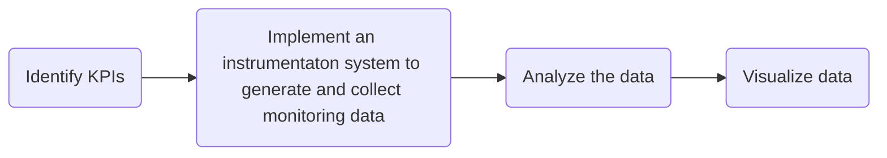

# Cloud Monitoring
Cloud monitoring is used to detect changes, errors, failures, and threats to a cloud's reliability and availability. Cloud monitoring depends on telemetry, or the remote measurement of variables. 

## Telemetry
In cloud administration, reliability and availability are measured using [metrics](/cloud/monitoring/README.md#metrics), logs, and traces. Each of these can be thought of as different types of measurements. 

### Metrics
Metrics are measurements of performance and represent the state of a service. The metrics an organization chooses to collect are based on what is most important to their users and/or customers. 

**Business Metrics**   
Text goes here. 

**Operational Metrics**  
Operational metrics measure the internal efficiency of DevOps processes. They emphasize performace and the stability of operations. Below are some examples.
* Latency: response time
* Throughput: requests per minute
* Availability: percent of time an app is responsive
* Utilization: percent of hardware use
* Error: number of errors
* Garbage Collector: time it takes to clean memory

**Application Performance Monitors**  
[Application Performance Monitors (APMs)](/cloud/monitoring/apm.md) are used to provide high-level and customer-oriented metrics. Below are some examples. 
* 5-star ratings
* Service abandonments (the time difference between a customer giving up before an app provides a service)
* Logon frequency 

### Logs
A log is a table of data used to record an event. A log can be generated using multiple [metrics](/cloud/monitoring/README.md#metrics). For example, a log of process execution would consist of the following [metrics](/cloud/monitoring/README.md#metrics):
* Resource usage
* Duration
* Concurrency information

**Auditable Logs**  
Logs are auditable when they allow you to analyze the operation of a system. Auditable logs must include the properties listed below. 
| Property                                  | Example           | 
| ----------------------------------------- | ----------------- |
| Activity time                             | 2023-10-13 11:16  |
| Activity category                         | Logon             |
| The identity of the activity owner        | cyberphor         |
| Names of objects affected by the activity | Domain Controller |
| Activity result                           | Successful        |

**Log Management Systems**  
Log management systems are used to manage log access and life cycles. Log management systems also perform the tasks listed below. 
* Normalization
* Correlation
* Reporting

**Logging Use Cases**  
Below is a list of use cases for logging. 
* Root Cause Analysis (RCA)
* A/B testing to make decisions
* Business Intelligence 
* User & Entity Behavior Analytics (UEBA)
* Monitoring and Alerting
* Compliance Auditing

### Traces
Traces used multiple logs describe a chain of events across a system. Below is an example.
1. A client submits a request to the Azure Kubernetes Service (AKS)
2. The request is ingested by an Ingestion Service
3. The Ingestion Service puts the request on a Service Bus
4. The Service Bus sends the request to a Workflow Service
5. The Worfklow Service sends the request to a delivery service, drone scheduler, and package service
