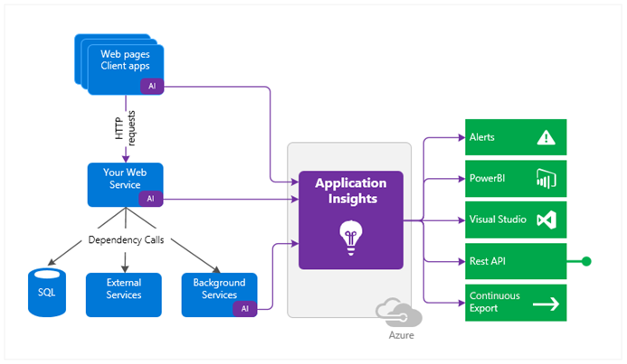

# App Service
The Azure App Service is used to host applications. 
* [App Service Plans](#app-service-plans)
* [Configuration Settings](#configuration-settings)
* [Post-Creation Settings](#post-creation-settings)
* [Deployment Slots](#deployment-slots)
* [Security Module](#security-module)
* [Application Insights](#application-insights)

## App Service Plans 
An ASP defines the compute resources needed to run an application. It defines the region, the virtual machine size, and number of virtual machine instances the application requires. The ASP is is also the "scale unit" of an application. To scale an application, you must change the ASP. The ability to scale depends on the pricing tier you selected (i.e., pick Standard or higher). You can save money by using an ASP for multiple applications. 

### Scaling App Service Plans
ASPs can be scaled up or out. Scaling up is when the CPU and RAM allocated is increased. Scaling out is when the number of virtual machine instances are increased. Scaling can be done manually or automatically. 

**Autoscaling Rules**  
You can configure your ASP to autoscale using *metric-based* or *time-based* rules. Valid metric statistics are: minimum, maximum, average, and total. 

## Configuration Settings
To configure an App Service resource, you must define a name, publish method (e.g., code or container), runtime stack, operating system, pricing tier, and deployment method. 

### Runtime Stack  
The runtime stack represents the language and Software Development Kits (SDK) your application needs to run. You can use Python, Node.js, Ruby, PHP, .NET, etc. The runtime stack you pick determines which operating systems you can use for the virtual machines in your ASP. 

### Pricing Tiers
**Free and Shared Tiers**  
In the Free and Shared Tiers, applications can't scale out. You're sharing your virtual machine instances with someone else. These tiers do not include an Service Level Agreement (SLA). 

**Basic, Standard, Premium, and Isolated Tiers**  
In these tiers, your application is on every virtual machine instance in your ASP. The same goes for your deployment slots. Your deployment slots are on every instance too. 

| Tier     | Max Apps  | Max Instances | Max Disk Space | Purpose                                                               |
| -------- | --------- | ------------- | -------------- | --------------------------------------------------------------------- |
| Free     | 10        | n/a           | 1 GB           | Developing apps                                                       |
| Shared   | 100       | n/a           | 1 GB           | Developing apps                                                       |
| Basic    | Unlimited | 3             | 10 GB          | Apps with low traffic                                                 |
| Standard | Unlimited | 10            | 50 GB          | Apps with high traffic, autoscaling, and deployment slot requirements |  
| Premium  | Unlimited | 30            | 250 GB         | Apps with performance requirements                                    |
| Isolated | Unlimited | 100           | 1 TB           | Apps with private environment requirements                            |

### Deployment Methods
You can deploy your App Service manually or automatically. Manual deployments involve using tools Git and the Azure CLI. Automated deployments use Azure Devops or GitHub. 

**Azure DevOps**  
With Azure DevOps, you can commit a change, rebuild your application, test it, release the new version, and then, automatically deploy the new version to your App Service resource (i.e., the virtual machine instances in your ASP). 

## Post-Creation Settings
After you create your app, you can configure it to route clients to the same instance (aka "ARR Affinity"), use an encrypted channel (e.g., HTTPS). and/or always be on. 

## Deployment Slots
A deployment slot is a version of your application, but with a different domain name. They are used to organize how change is introduced to your application users. For example, say you want to use a Blue-Green strategy for introducing change to an application that uses a domain name called "cyberphor." The "Blue" deployment slot is the production version of it. The "Green" deployment slot is a newer version it and uses the domain name "cyberphor-staging." Once the new version has been approved, the slots will be swapped. Deployment slots are only available in the Standard pricing tier and above. 

### Swapping Deployment Slots
When you swap deployment slots, some of the settings will not persist (e.g., OS settings). 

**Settings That Will Persist**  
The following settings are will persist during a deployment slot swap:
* Connection strings
* Public certificates
* Path mappings
* Handler mappings
* Service endpoints

**Settings That Will Not Persist**    
The following settings are will not persist during a deployment slot swap:
* Custom domain names (e.g., "cyberphor-staging")
* Scale settings
* IP restrictions
* Diagnostic settings

## Security Module
App Service resources include a Security Module. When it's enabled, all HTTP requests are routed through it before being sent to your application. The Security Module can (1) perform authentication using a specific provider, (2) validate/refresh authorization tokens, (3) add identity information to request headers, and (4) generate logs. 

## Application Insights
Apps can be monitored using a resource called "Azure Application Insights" (AAI). AAI resources are provided via the Azure Monitor service. AAIs can monitor an application's page views, runtime stack, container host, etc. 

