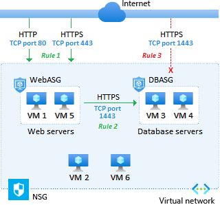

# Azure Network Services
* [Azure Virtual Networks](#virtual-networks)
* [Azure Subnets](#azure-subnets)
* [Azure Network Security Groups](#azure-network-security-groups)
* [Azure Endpoints](#azure-endpoints)
* [Azure DNS](#azure-dns)
* [Azure Load Balancers](#azure-load-balancers)
* [Azure Traffic Manager](#azure-traffic-manager)
* [Azure VPN Gateway](vpn-gateway/README.md)
* [Azure ExpressRoute](expressroute/README.md)

## Azure Virtual Networks
An Azure Virtual Network (VNet) is two or more virtual machines using the same IP address scheme. VNets allow resources (e.g., virtual machines, load balancers, gateways, and containers) to communicate with each other and/or the Internet. They're used in private clouds, hybrid clouds, and Virtual Private Networks (VPNs). Once you create a VNet, you can't change it's IP address scheme. 

### Azure Network Interfaces
An Azure network interface is a virtual Network Interface Card (NIC). Azure virtual machines need them to communicate with each other and/or the Internet. 

### Peering  
Peering is when two networks are connected to each other using Azure. Peering is region-agnostic and can be achieved using VNets and on-prem networks. Traffic between peered networks is transmitted over the Azure backbone and therefore private. 

## Azure Subnets
An Azure Subnet is a segment of a VNet with a unique IP address range (i.e., network ID, default gateway, and broadcast address). 

### Reserved IP Addresses  
In every subnet, Azure uses five IP addresses. They're reserved for a network ID, default gateway, broadcast address, and two DNS servers. For example, consider the IP address range `192.168.0.0/24`. Azure would use `192.168.0.0` for the network ID, `192.168.0.1` for the gateway, `192.168.0.255` for the broadcast address, and `192.168.0.2` and `192.168.0.3` for DNS servers.

## Azure Network Security Groups  
Azure Network Security Groups (NSGs) are used to filter traffic between network interfaces and/or subnets using IP addresses and ports. By default, Azure routes traffic between all subnets in a VNet. To layer NSGs, assign one to the subnet and another to the network interface in question. 

### NSG Rules
Rules are processed by priority value in ascending order (e.g., 100, 101, and finally, 102). For inbound traffic, subnet-wide rules are processed first. For outbound traffic, network interface rules are processed first. Azure creates multiple NSG rules by default (e.g., "DenyAllInbound" and "AllowInternetOutbound"). To override a default rule, you must create another one with a better priority value. Default rules cannot be removed. Rules can filter by service tag. Valid service tags include: VirtualNetwork, SQL, Storage, AzureLoadBalancer, and AzureTrafficManager. 

**Default Inbound NSG Rules**  

**Default Outbound NSG Rules**  

## Azure Application Security Groups
Azure Application Security Groups (ASG) allow you to filter traffic between virtual machines using groups. Shown below is an example of how you could provide the public access to your web servers while protecting your database servers. The difference between NSGs and ASGs is with ASGs, you're not dealing with IP addresses and ports. 

## Azure Endpoints
### Public Endpoint
A Public Endpoint is a an Azure network interface with a public IP address. Public must leave the VNet to access Azure services. 

**Public IP Addresses**  
The Standard SKU of a public IP address in Azure uses static IP addressing, denies inbound traffic by default, and is zone-redundant. The Basic SKU supports static and dynamic IP addresses. Yet, it's allows inbound traffic by default and is not zone-redundant. 

### Private Endpoint
A Private Endpoint is a an Azure network interface with a private IP address. Private Endpoint traffic must leave the VNet to access Azure services. 

**Private Links**  
A Private Link is a Private Endpoint that uses the Azure backbone to access Azure services. It requires an IP address from your VNet. 

**Service Endpoints**  
A Service Endpoint is when an Azure service has been configured to accept connects from your VNet. They're useful when more than one person or resource (e.g., virtual machine) needs to access an Azure service. 

## Azure DNS
Azure DNS is used to manage Domain Name System (DNS) records. Azure DNS can be configured to protect your records using Azure RBAC. 

## Azure Load Balancers  
Azure Load balancers are used to distribute traffic in Azure. 

## Azure Traffic Manager
Azure Traffic Manager is a load balancing service. It distributes traffic from the Internet to *deployment groups* closest to the user. It can also provide *health monitoring*. 
 