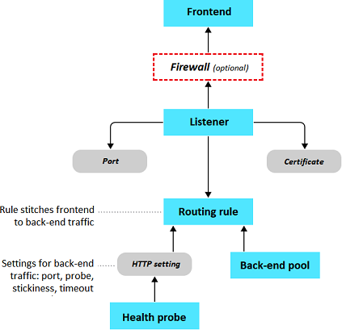
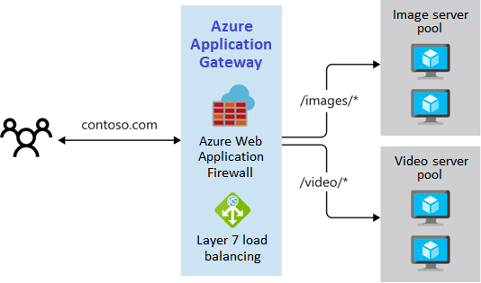
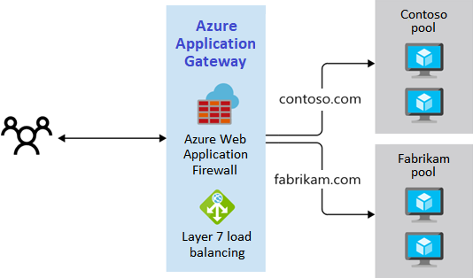

# Azure Application Gateways
Azure Application Gateways are load balancers for web traffic. They are used to distribute traffic across back-end pools of virtual machines, scale sets, or on-prem servers. Application Gateways support round-robin load balancing, session persistence, multiple web protocols (HTTP, HTTPS, HTTP/2, and WebSocket), auto-scaling, and Web Application Firewall (WAF) filtering. 

## Routing
Application Gateways can route by path or site. 

### Path-Based Routing
Path-based routing is helpful when you have each pool optimized to handle a different type of requests (e.g., images or videos).  

### Site-Based Routing
Site-based routing is helpful when your Application Gateway is load balancing multiple applications.

