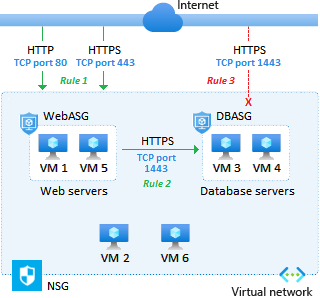

# Azure Application Security Groups
Azure Application Security Groups (ASG) allow you to filter traffic between virtual machines using groups. Shown below is an example of how you could provide the public access to your web servers while protecting your database servers. The difference between NSGs and ASGs is with ASGs, you're not dealing with IP addresses and ports. 

