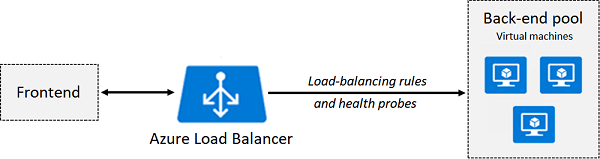

# Azure Load Balancers  
Azure Load Balancers are used to distribute traffic in Azure. There's external load balancers and internal load balancers. Internal balancers do not have public IP addresses and therefore do not support back-end pools containing virtual machines from different VNets. 
* [SKUs](#skus)
* [Front-End IP Configurations](#front-end-ip-configurations)
* [Back-End Pools](#back-end-pools)
* [Health Probes](#health-probes)
* [Load Balancing Rules](#load-balancing-rules)

## SKUs
Azure Load Balancers have two SKUs: Basic and Standard. 

### Basic SKU
The Basic SKU only supports inbound TCP or HTTP traffic. Load balancers with this SKU are open by default, but can be controlled using NSGs. The Basic SKU supports up to 300 back-end pools. In this SKU, virtual machines must belong to the same scale set or availability set.

### Standard SKU
The Standard SKU supports inbound and outbound TCP, HTTP, and HTTPS traffic. Load balancers with this SKU are closed by default unless inbound traffic is allowed by a NSG or from the internal VNet. The Standard SKU supports up to 1,000 back-end pools. In this SKU, virtual machines only need to belong to the same VNet. 

## Front-End IP Configurations
The front-IP configuration defines the load balancer's public or private IP address. 

## Back-End Pools
The back-end pool represents the group of virtual machines you're load balancing. It consists of the IP addresses of network interfaces connected to your load balancer.

### Availability Sets
Availability Sets are used to separate virtual machines into update or fault domains. They're created at the same time as a virtual machine. To add a virtual machine to an availability set, you must delete it and recreate it. Mitigate single-points-of-failure in your application by separating its components (e.g., frontend, backend, and data) into separate availability sets. Availability sets can be configured to load balance across an availability set. 

**Update Domain**  
An update domain is a group of virtual machines that can be updated and/or rebooted at the same time. During [planned maintenance](/cloud/azure/offerings/compute/README.md#maintenance-events), only one update domain can be rebooted at a time. You can define up to 20 update domains. 

**Fault Domain**  
A vault domain is a group of virtual machines that share the same hardware (e.g., switches or cabinets).

 

## Health Probes
The status of a back-end pool is monitored using health probes. If a health probe fails, the load balancer will stop sending traffic to it. A health probe includes the following settings: name, URI, protocol, port, interval in seconds, and threshold (i.e., how many failed probes the load balancer will tolerate). Another probe method is using an agent. 

**Successful Probes**  
A successful HTTP probe is when an HTTP code 200 is returned. A successful TCP probe is when a TCP connection is established. 

## Load Balancing Rules
Load balancing rules are used to control how traffic is distributed across your back-end pool. Each rule maps a front-end socket to a back-end socket. A load balancing rule includes the following settings: IP version, front-end socket, back-end socket, health probe, and distribution mode. 

### Distribution Modes 
Azure Load Balancers distribute traffic using a five-tuple hash (the default) or a two-tuple hash. Using a client's two-tuple hash is also known as "source IP address affinity."  

**Five-Tuple Hash**  
A five-tuple hash includes the following:
* Source IP address
* Source port
* Destination IP address
* Destination port
* Protocol

**Two-Tuple Hash**  
A two-tuple hash includes the following:
* Source IP address
* Destination IP address