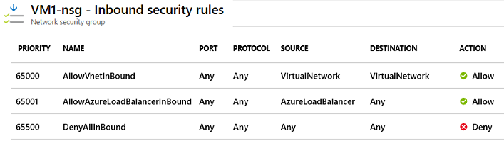
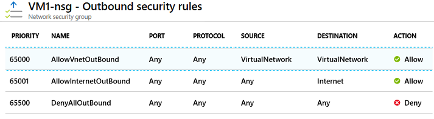

# Azure Network Security Groups  
Azure Network Security Groups (NSGs) are used to filter traffic between network interfaces and/or subnets using IP addresses and ports. By default, Azure routes traffic between all subnets in a VNet. To layer NSGs, assign one to the subnet and another to the network interface in question. 

## NSG Rules
Rules are processed by priority value in ascending order (e.g., 100, 101, and finally, 102). For inbound traffic, subnet-wide rules are processed first. For outbound traffic, network interface rules are processed first. Azure creates multiple NSG rules by default (e.g., "DenyAllInbound" and "AllowInternetOutbound"). To override a default rule, you must create another one with a better priority value. Default rules cannot be removed. Rules can filter by service tag. Valid service tags include: VirtualNetwork, SQL, Storage, AzureLoadBalancer, and AzureTrafficManager. 

### Default Inbound NSG Rules  

### Default Outbound NSG Rules  
