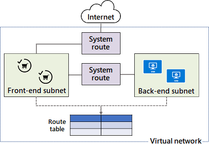
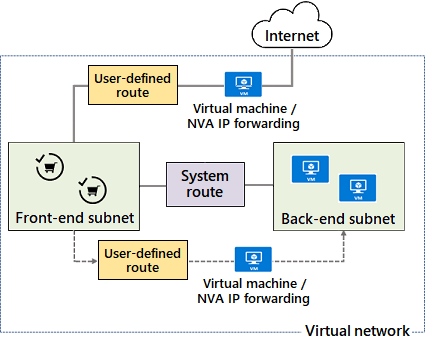
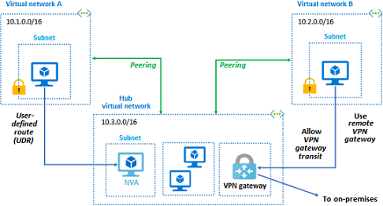
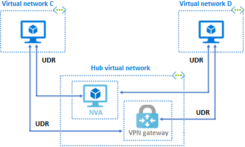

# Azure Virtual Networks
An Azure Virtual Network (VNet) is two or more virtual machines using the same IP address scheme. VNets allow resources (e.g., virtual machines, load balancers, gateways, and containers) to communicate with each other and/or the Internet. They're used in private clouds, hybrid clouds, and Virtual Private Networks (VPNs). Once you create a VNet, you can't change it's IP address scheme. Multiple VNets can be connected together using peering or an Azure VPN Gateway. 
* [Azure Network Interfaces](#azure-network-interfaces)
* [Routes](#routes)
* [Peering](#peering)
* [Hub-and-Spoke Networks](#hub-and-spoke-networks)

## Azure Network Interfaces
An Azure network interface is a virtual Network Interface Card (NIC). Azure virtual machines need them to communicate with each other and/or the Internet. 

## Azure Subnets
An Azure Subnet is a segment of a VNet with a unique IP address range (i.e., network ID, default gateway, and broadcast address). 

### Reserved IP Addresses  
In every subnet, Azure uses five IP addresses. They're reserved for a network ID, default gateway, broadcast address, and two DNS servers. For example, consider the IP address range `192.168.0.0/24`. Azure would use `192.168.0.0` for the network ID, `192.168.0.1` for the gateway, `192.168.0.255` for the broadcast address, and `192.168.0.2` and `192.168.0.3` for DNS servers.

## Routes

### System Routes
Systems routes are used by Azure to control traffic between virtual machines, subnets, and the Internet. They are added to the VNet's routing table automatically. 

### User-Defined Routes
User-Defined Routes (UDRs) are used to specify a virtual machine's next hop. The next hop can be a VNet, Network Virtual Appliance, or the Internet. Traffic sent "None" next hop is dropped. UDRs are free. 

## Peering
Peering is when you connect two VNets together. Peering traffic is sent over the Azure backbone and therefore private and fast. After VNets are peered, they're still managed as separate resources. There's two types of peering: Regional Peering and Global Peering. Your Azure account must have the "Network Contributor" role to peer VNets. When you peer two VNets, there are two connections between both of them. There should be one connection going from VNet "A" to VNet "B" and another going from VNet "B to VNet "A." The IP address ranges used for both VNets cannot overlap. When you peer VNets, they status is first "Initiated" and then "Connected." Peering is not established until both networks are in a "Connected" status. 

### Regional Peering  
Regional Peering is when two VNets from the same region are connected together. 

### Global Peering   
Global Peering is when two VNets from different regions are connected together. Global Peering is not supported in Azure Government Cloud. 

## Hub-and-Spoke Networks
A hub-and-spoke network is when multiple VNets are connected using Peering or Service Chaining. Service chaining is when UDRs are defined between VNets, Network Virtual Appliances (NVAs), and/or VPN Gateways. *Gateway Transit* is when VNets peer with a VPN Gateway to access other resources. 

### Using Peering to Create a Hub-and-Spoke Network  

### Using Service Chaining to Create a Hub-and-Spoke Network  
