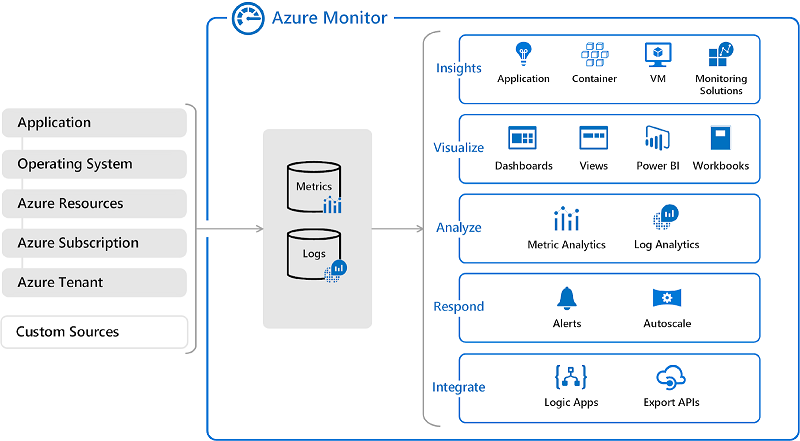
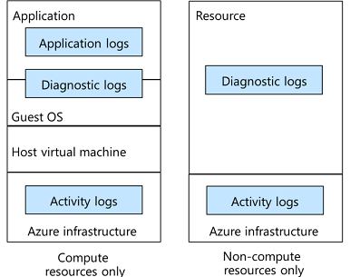
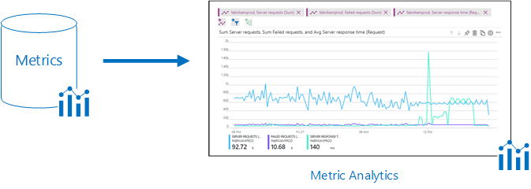
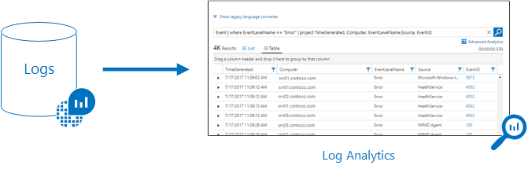

# Azure Monitor
Azure Monitor helps you collect, analyze, and respond to telemetry data. Application Insights, Metrics Explorer, and Log Analytics allows you to collect and analyze while Dashboards and Workbooks visualize. Alerts are used to sending notifications of when certain conditions are met. Event Hubs allow you to integrate Azure Monitor into other tools like SIEM servers. 
* [Activity Log](#activity-log)
* [Application Insights](#application-insights)
* [Metric Explorer](#metric-explorer)
* [Log Analytics](#log-analytics)
* [Dashboards](#dashboards)
* [Workbooks](#workbooks)
* [Alerts](#alerts)
* [Event Hubs](#event-hubs)

  

## Activity Log
The Activity Log contains telemetry data automatically collected by Azure Monitor. Azure Monitor stores Activity Log data for 90 days. Activity Log data can be filtered by subscription, timespan, severity, resource type, event categories, etc. 

### Event Categories
The Activity Log includes the following event categories: Alert, Security, Policy, Autoscale, Service Health, Resource Health, Administrative, and Recommendation. 

**Security**  
Security events are generated by Microsoft Defender for Cloud. 

**Policy**  
Policy events are generated by Azure Policy (e.g., Audit or Deny). 

**Service Health**  
Service Health events pertain to the service in question (e.g., Azure SQL Data Warehouse). 

**Resource Health**  
Resource health events describe the status of the resource in question. 

**Administrative** 
Administrative events are CRUD operations. 

## Azure Monitor Agent
To extend the data collected by Azure Monitor, (1) enable diagnostics and (2) add an Azure Monitor Agent. The Azure Monitor Agent can be configured to collect metrics and logs from within Windows and Linux machines. 

## Application Insights  
Application Insights allows you to conduct Application Performance Monitoring (APM) using an SDK or agent. 

### Availability Tests  
Availability tests are used to check if an app is responding as expected. After an availability test is configured, the Application Insights agent will send web requests to your app from around the world. Then, it will notify you if the app is responding slowly or not at all. 

**Classic Test**  
A "Classic Test" with default settings will test the availability of your web app from five different locations every 5 minutes (the standard of success is the receipt of a HTTP response status 200 within 120 seconds). 

## Metrics Explorer
Metrics are numerical values used to describe a system at a given point-in-time (e.g., CPU usage). Metrics Explorer allows you to analyze metrics collected by Azure Monitor. 

## Log Analytics
Logs are records of activity (e.g., Victor authenticated with the Domain Controller at 0900 EST). Log Analytics allows you to analyze logs collected by Azure Monitor. Queries are performed using the Kusto Query Language (KQL). KQL is a different version of the language used by Metrics Explorer. 

## Dashboards
Text goes here.

## Workbooks
Text goes here.

## Alerts
Text goes here. 

## Event Hubs
Text goes here.

