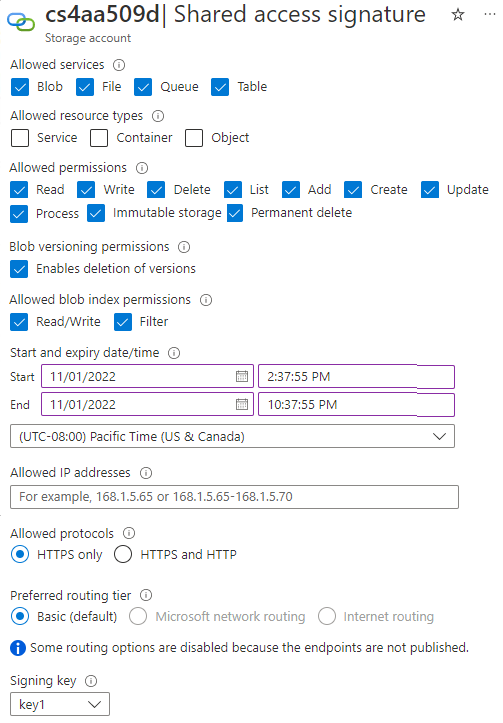
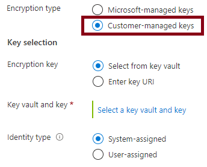

# Azure Storage Security

## Network Access 
### Public Read Access
Public read access can be managed at the storage account, container, and blob level. 

**Storage Accounts**  
By default, storage accounts are configured to allow pubic read access from all networks. Access can be restricted to specific public IP addresses and/or virtual networks within the same region as your storage account. 

**Azure Blobs**  
If a storage account has the "AllowBlobPublicAccess" setting enabled, Azure Blobs can be configured to allow anonymous entities to access containers and/or blobs.

### Secure Transfer Required  
If a storage account has the "Secure transfer enabled" setting enabled, REST APIs must connect using HTTPS. Connections via HTTP will be ignored. 

## Authorization
Azure Storage services support three different authorization options: [Public Read Access](#public-read-access), Shared Key, or Shared Access Signature (SAS) tokens. User delegated SAS tokens are the most secure because they require you to have an SAS token and know the associated user's Entra ID credentials. 

### Shared Keys
A Shared Key is an encrypted string that must be included in the Authorization Header of every Azure Storage request (i.e., you won't be able to access the storage account without including it in your request). It's used to allow an entity complete access to your storage account. If you're using the Azure CLI and `az storage blob` command, it's an argument for the `--connection-string` parameter. 

### SAS Tokens
SAS tokens are URIs. They are used to give entities access to one or more services within your storage account for a finite amount of time. They can be restricted to specific IP addresses and protocols (e.g., HTTPS). In practice, entities append SAS tokens to the URL of your storage account. Described below are some of the parameters included in a SAS token. If you're using the Azure CLI and `az storage blob` command, it's an argument for the `--sas-token` parameter. 
* Resource URI: `blob, file, or queue`
* Storage Version: `sv=2024-01-02`
* Storage Service : `ss=bf` (Azure Blobs and Azure Files)
* Expiry Time: `se=2014-01-31` 
* Permissions: `sp=rw`
* IP Range: `sip=1.1.1.1-2.2.2.2`
* Protocol: `spr=https`
* Signature: `sig=F%6GRVAZ5Cdj2Pw4tgU7Il STkWgn7bUkkAg8P6HESXwmf%4B` (Base64 encoded HMAC signature)

**User Delegation SAS Tokens**  
User Delegation SAS tokens are used for granting access to Azure Blobs. They're secured using Entra ID credentials. Use this option if your application depends on a managed identity or service principal. When the application authenticates, Entra ID will given them an OAuth 2.0 token to access Azure Storage. 

**Account-Level SAS Tokens**  
Account-Level SAS tokens are used for granting access to multiple services within your Storage Account.

**Service-Level SAS Tokens**  
Service-Level SAS tokens are used for granting access to one service within your Storage Account. 

### Access Policies  
Access Policies are used to group up to five SAS tokens of the same service together (e.g., Blobs, Files, Queues, or Tables). They make it easier to manage multiple SAS tokens. When you create an SAS token by itself, you must change your storage account access key to revoke or change it. Access policies don't require you to do this. 

## Encryption
Data-at-rest is encrypted in Azure Storage using AES 256. Data-in-transit can be encrypted using HTTPS, SMB 3.0, or Client-Side Encryption. 

### Customer-Managed Encryption Keys
Data in Azure Storage can be encrypted using Microsoft-managed keys or keys you generated yourself. Keys are referenced using Azure Key Vault or a URL to where they're stored. 

