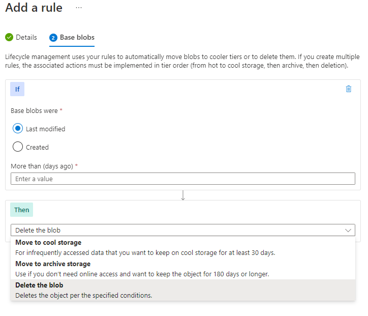

# Azure Blobs 

Azure Blobs is a service for storing [blobs](/storage/README.md#unstructured-data). It can be accessed via the Network File System (NFS) protocol. Blobs can be uploaded and/or downloaded using: browsers, Azure PowerShell, Azure CLI, or Azure Storage Client libraries (Python, Java, Ruby, PHP, and .NET).
* [Blob Types](#blob-types)
* [Blob Containers](#blob-containers)
* [Blob Container Naming Conventions](#blob-container-naming-conventions)
* [Blob Container Access Levels](#blob-container-access-levels)
* [Blob Access Tiers](#blob-access-tiers)
* [Blob Lifecycle Management Rules](#blob-lifecycle-management-rules)
* [Blob Replication](#blob-replication)

## Blob Types
Azure Blobs supports three different types of blobs: block blobs, append blobs, and page blobs. Once a blob added to a storage account, its type cannot change.

### Block Blobs
Block blobs are assembled from blocks. They are the most common. They're ideal for storing blobs that won't change in size (e.g., images). 

### Append Blobs
Append blobs are optimized for append operations. They are meant for blobs that will change in size (e.g., logs).

### Page Blobs
Page blobs are optimized for read/write operations. They are meant for disks used in virtual machines. Page blobs can be up to 8 TBs in size. 

## Blob Containers
Blob containers are used to organize blobs. Blobs cannot be stored in a storage account without a container. 

## Blob Container Naming Conventions
Blob container names must comply with the naming conventions described below. 
* Length: 3 to 63 characters
* Character sets: lowercase, numbers, and hyphens
* First character: letter or number

## Blob Container Access Levels
There are three access levels for blob containers: Private, Blob, and Container. You must enable "Allow Blob anonymous access" in your storage account to use the Blob or Container access levels. 

### Private Access Level
The Private access level does not allow anonymous entities to access containers or blobs. Storage accounts are configured with private access by default. 

### Blob Access Level  
The Blob access level allows anonymous entities to read blobs only. They cannot list the blobs within a container.

### Container Access Level  
The Container access level allows anonymous entities to list blobs within a container and read them.  

## Blob Access Tiers
There are four "access tiers" in Azure Blobs. Each tier is optimized to meet different access frequency and speed requirements.

### Hot Access Tier
Data labeled with "hot access" is optimized for frequent and fast access (e.g., SSDs and load balancing). Access is cheap, but storage is not. 

### Cool Access Tier  
Data labeled with "cool access" is optimized for infrequent and slow access (e.g., SSDs). This tier is meant at least 30 days of storage. 

### Cold Access Tier
Data labeled with "cold access" is optimized for infrequent and slow access (e.g., HDDs). This tier is meant at least 90 days of storage. 

### Archive Access Tier  
Data labeled with "archive access" is optimized for infrequent and slow access (e.g., stored offline). This tier is meant at least 180 days of storage. You can only set Archive Access at the blob-level not for your entire storage account.

## Blob Lifecycle Management Rules
Blob lifecycle management rules allow you to automatically change a blob's access tier and set its expiration date. They help you reduce storage costs.

### If Statements
If statements check if a blob was modified or created after a given number of days.

### Then Statements
Then statements include: move to cool storage, move to archive storage, or delete the blob. 

## Blob Replication
Azure Blobs supports blob replication. During replication, the blob's metadata, data, and versions are mirrored between a source container and destination container. The containers can be in different blob access tiers. Yet, both containers must have blob versioning enabled. When you upload a new version of a blob, you'll be prompted to "overwrite" the previous one. Previous versions can be viewed by blob (click on the ellipse). Blob replication does not support snapshots.

**Use Cases**  
Below are some uses-cases for replicating blobs.
* Puting blobs closer to clients
* Processing blobs in multiple locations simulatenously 
* Processing blobs in one location so only the results are replicated
* Reducing costs (e.g., replicate to a storage account that uses a "colder" tier)

## Pricing Considerations
Below are some pricing considerations when using Azure Blobs. 
* As tiers get colder, storage gets cheaper but access (transactions + reads) gets more expensive
* Blobs leaving a region are expensive (e.g., region-based replication)
* Changing from cool to hot access is the same price as *reading* all the data in cool storage
* Changing from hot to cool access is the same price as *writing* all the data in cool storage