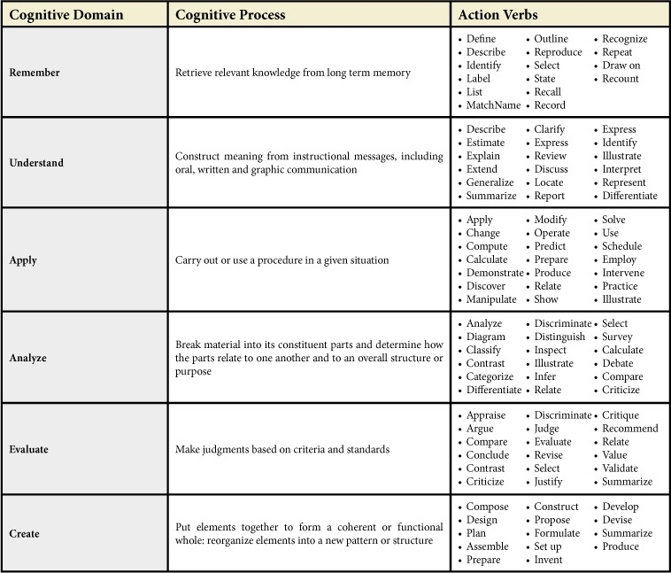

# Content Creation

## Bloom's Hierarchy of Learning
### Knowledge
There's three elements to knowledge: factual knowledge (e.g., lecture), procedural knowledge (e.g., teaching in a simulation), and conceptual knowledge (e.g., case-based). 

### Comprehension
Text goes here.

### Application
Text goes here.

### Analysis
Text goes here.

### Synthesis
Text goes here.

### Evaluation
Text goes here.

## Learning Objectives
> A learning goal is a broad statement of an expected learning outcome of a course or curriculum. Learning goals provide a vision for the future and often summarize the intention or topic area of several related learning objectives. Learning objectives are drawn from the learning goals. 

A learning objective describes what the student will be capable of after consuming the content. It outlines the attitude, knowledge, and skills they will gain. Learning objectives have five properties (aka "SMART"): Specific, Measurable, Attainable, Relevant, and Time-bound. While longer than broad objectives, SMART objectives help teachers focus on what they intend to teach, assess, and offer as feedback. It shapes the scope of learning, method of instruction, and type/quality of evaluation. 

The following is an example: *Upon completion of the Python workshop, students will be able to develop a program to configure a Cisco router using the Netmiko module according to applicable US Department of Defense Security Technical Implementation Guides.* 

The point of a learning objective is to describe the intended outcome of your content. An objective represents what the student will be able to get out of their time learning. Also, objectives should be separate from each other. Don't combine topics. Lastly, make sure to identify which "cognitive domain" the student is expected perform in. The following are cognitive domains: remember, understand, apply, analyze, evaluate, and create.  They are ordered by lowest to highest congitive skill required. 

### How to Write a Learning Objective
**Step 1.** Begin your objectives with a prefix similar to this: "Upon completion of the Python workshop, students will be able to..."

**Step 2.** Identify the concepts the student must learn and how they will demonstrate their understanding. You can do this by picking an action verb that is observable and measurable. The following verbs are NOT observable: understand, know, learn, appreciate, believe, and comprehend. 

## References
* [How to Write Well-Defined Learning Objectives by Debnath Chatterjee (MD, FAAP) and Janet Corral (PHD)](https://www.ncbi.nlm.nih.gov/pmc/articles/PMC5944406/)