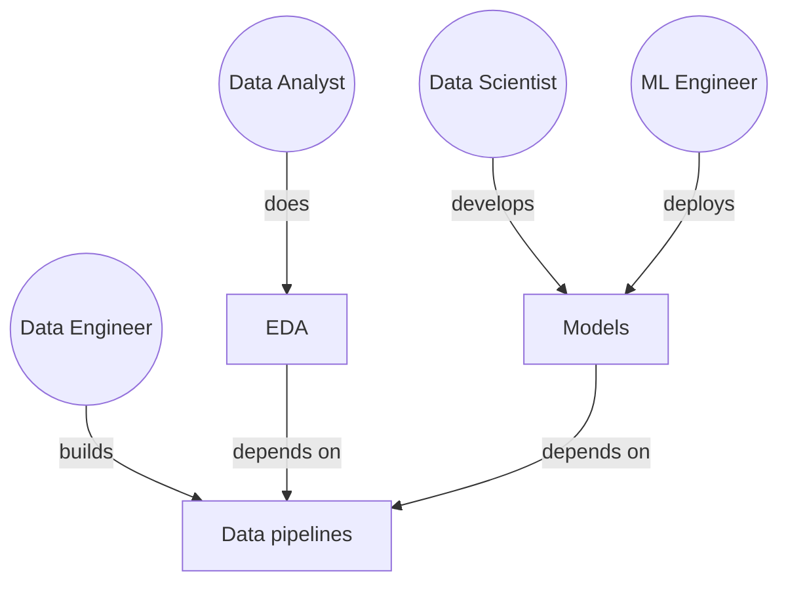

# Data Engineering
Data engineering is the process of categorizing, processing, and visualizing data to provide insight.
* [Data Categorization](data-categorization/README.md)
* [Data Operations](data-operations/README.md)
* [Data Visualization](data-visualization/README.md)

## Data Science Roles
Most Data Science teams have a Data Analyst, Data Scientist, Data Engineer, and Machine Learning (ML) Engineer. 

    

### Data Analyst
The Data Analyst performs Exploratory Data Analysis (EDA) using domain expertise. 

### Data Scientist
The Data Scientist develops and evaluates ML models.  

## Data Engineer
The Data Engineer manages the data sources, data stores, and data pipelines used by the team. They organize data to maximize value and accessibility. Their role is a combination of automation (e.g., scripting and developing Infrastructure-as-Code), database management, and cloud computing. Their responsibilities include the following:
* Designing large-scale and fault-tolerant data systems
* Building Extract-Transform-Load (ETL) pipelines and Application Programming Interfaces (APIs)
* Testing and evaluating the security and privacy of data
* Collaborating with other team members to translate business needs into data models

## ML Engineer
The ML Engineer deploys ML models.
