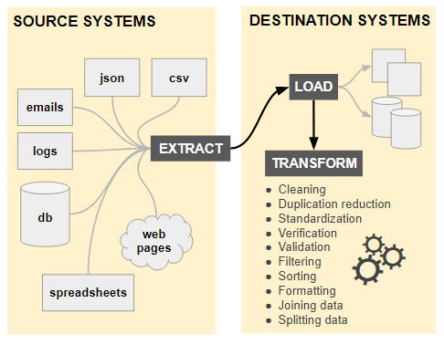

# Data Engineering
Data engineering is the process of categorizing, processing, and visualizing data to provide insight. Data Engineers are responsible for data stores and data pipelines. They organize data to maximize value and accessibility. 
* [Data Encoding](#data-encoding)
* [Data Types](#data-types)
* [Data Operations](#data-operations)

## Data Encoding
**Text-Encoded Data**  
Text-encoded data is meant to be read by a human. 

**Binary-Encoded Data**  
Binary-encoded data is meant to be read by a computer. 

## Data Types
### Structured Data
Structured data is flat, has a predefined schema, and originates from table-based data sources like relational databases and CSV files. Data is considered flat when it uses rows and columns.

**Quantitative**    
Can be counted in numerical values using statistics such as mean, median, mode, frequency, min/max, and standard deviation (i.e., how data is dispersed in relation to the mean)
* Discrete Quantitative: whole number values (cannot be divided)
* Continuous Quantitative: fractional values (can be divided)

**Qualitative**  
Cannot be counted, but describes attributes.
* Nominal Qualitative: unordered categories (e.g., colors)
* Ordinal Qualitative: ordered categories (e.g., pain scale)
* Binary Qualitative: belongs to one of two categories (e.g., pass or fail)

### Semi-Structured Data
Semi-structured data uses key-value pairs but does not have a predefined schema. Semi-structured data originates from nested data sources like JSON, XML, and email files. 

### Unstructured Data  
Unstructured data is data without a pre-defined set of fields. Unstructured data must be *preprocessed* for it to be converted into structured data. Below is a list of examples.
* Pictures
* Videos
* Microsoft PowerPoint files
* The body of an email

## Data Operations
There are two ways to process data: ETL (Extract, Transform, and Load) or ELT (Extract, Load, and Transform). ELT is preferred for handling big and/or unstructured data. 

### Extract
The extraction phase is when data is pulled from sources such as files, databases, and APIs. 

**Considerations**
* Permissions
* Frequency
* Automation (does extraction require a human?)
  * Partial extraction requires a trigger (the alternative would be to use the delta between timestamps to filter for new data)
  * Full extraction might be necessary when there's no way to effectively discern between new and old data

### Transform
The transformation phase is when data is cleaned and/or manipulated. 

**Cleaning Data**  
Data cleaning is when you find and fix quality-related problems in your data set. 
* Encoding differences
* Inconsistencies
* Misspellings
* Duplicate entries
* Conflicting values
* Misleading names

**Manipulating Data**  
Data manipulation is when you modify data so it'll fit inside your target data set. 
* Splitting fields
* Normalizing fields (e.g., source_ip vs src_ip)
* Adding derived fields (i.e., data enrichment)

### Load
The loading phase is when you deliver your data set. The final result could be an object (e.g., list of dictionaries), file, or database.  

**Extract, Transform, and Load (ETL)**  

**Extract, Load, and Transform (ELT)**   

### Visualization Types
**Bar Charts**  
Bar charts are used to compare categorical data. 

**Pie Charts**  
Pie charts are used to compare categorical data. Don't use them.

**Line Charts**  
Line charts are used to show changes over time. 

**Scatter Plots**  
Scatter plots are used to show relationship between two numerical variables (used to identify correlation and outliers).

**Histograms**  
Histograms are used to show frequency or proportion of numerical data.

**Box Plots**  
Box plots are used to show the average, median, etc. of data.

**Data Visualization Pitfalls**  
Below is a list of common data visualization pitfalls.
* Using more variables than needed
* Using the wrong visualization
* Using the scale of given data the wrong way (i.e., zooming in or out too much)
* Drawing attention to the wrong insight (separating charts when they should be combined)
* Confusing correlation as causation 
* Ignoring important attributes of your data

**Data Visualization Best Practices**  
Below is a list of data visualization best practices. 
* Consider colorblindness
* The less color the better
* Use different colors to differentiate variables