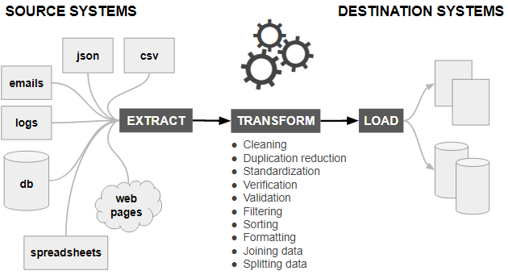
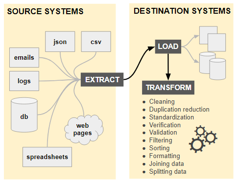

# Data Operations

## Data Integration
Data Integration is when you connect a data source to a data store using a data pipeline. 

### Data Source
A data source can be anything. For example, it can be a CSV file, JSON file, SQL database, and even a web page.

### Data Pipelines
A Data Pipeline is technology that extracts operational data from a data source, transforms it, and loads it into a data store.

### Data Stores
**Data Lake**  
A Data Lake stores operational data in files. 

**Data Warehouse**  
A Data Warehouse stores analytical data into relational tables.

## Data Transformation
Data Transformation is when you convert *operational data* from a single data source into *analytical data*. This is done using an ETL or ELT process. The primary difference between the two is when transformation occurs. ELT extracts, tranforms, and loads data while ELT extracts, loads, and then transforms data. It's best practice to use the latter when handling big and/or unstructured data.

### Extract  
The Extract phase of Data Transformation pulls data from sources such as files, databases, and APIs. It's important to consider the following when extracting data: permissions, frequency, and automation. For example, partially-automated extraction relies on a trigger or timestamp delta. Fully-automated extraction does not discern between old and new data. 

### Transform
The Transform phase of Data Transformation is when data is cleaned and/or manipulated. 

**Data Cleaning**  
Data Cleaning is when you find and fix quality-related problems in your data set. This may include addressing the following: encoding differences, inconsistencies between records/documents, misspellings, duplicate entries, conflicting values, and misleading names. 

**Data Manipulation**  
Data Manipulation is when you modify data so it fits in your data set. This may include splitting, normalizing (e.g., source_ip vs src_ip), or adding derived fields (i.e., data enrichment). 

### Load
The loading phase is when you deliver your data set. The final result could be an object (e.g., list of dictionaries), file, or database.  

## Data Consolidation
Data Transformation is when you convert *operational data* from multiple data sources into *analytical data*. 