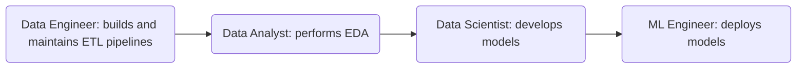

# Data Engineering Roles
A Data Science team includes a Data Engineer, Data Analyst, Data Scientist, and Machine Learning (ML) Engineer. The Data Analyst performs Exploratory Data Analysis (EDA) using domain expertise. The Data Scientist develops and evaluates ML models. The ML Engineer deploys ML models. 

## Data Engineer
The Data Engineer manages the infrastructure used by the team. Their role is a combination of automation (e.g., scripting and developing Infrastructure-as-Code), database management, and cloud computing. Their responsibilities include the following:
* Designing large-scale and fault-tolerant data systems
* Building Extract-Transform-Load (ETL) pipelines and Application Programming Interfaces (APIs)
* Testing and evaluating the security and privacy of data
* Collaborating with other team members to translate business needs into data models

