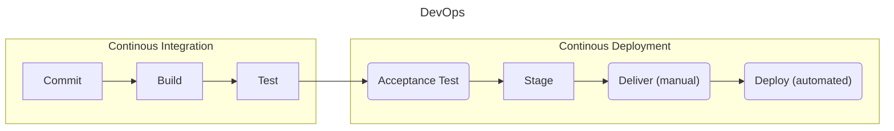

# DevOps
Organizational strategies describe how people, process, and technology will be used to meet stakeholder requirements. DevOps is an organizational strategy for rapidly producing high-quality software. 

## Principles
An organization can implement DevOps by adopting the principles described below.

**Change is Good**  
Embrace and foster collaboration, innovation, and continuous improvement. 

**Automate as Much as Possible**  
Automate during every phase of your software development life cycle (e.g., building, testing, and deploying). Automation reduces time, effort, inconsistency, and errors in software updates.

Try NOT to completely automate the following: 
* Code Review: a human understands context and can identify logical errors.
* Change Management: the coordination of people may be necessary to implement a software update.
* Identity and Access Management: a human should decide what permissions are appropriate to give to another human * Security: a human understands context and can identify false positives.

How to Implement Automation
* Identify and automate a small number of manual tasks using scripts.
* Track changes to the automation scripts using a version control system.
* Test the automation scripts for reliability.
* Monitor the automation scripts for performance and errors.
* Establish clear ownership of the automation scripts so they are well-maintained.

**Code Small and Often**  
Seek to code, build, test, and deploy small software updates often.

**Seek and Respond to Feedback Often**  
Continuous delivery depends on established and clear feedback loops.

## Goals
There are two goals in DevOps (1) improve software quality and (1) increase release velocity.

## Benefits
DevOps provides the following benefits. 

**Better Communication Between Teams**  
DevOps seeks to remove the “Wall of Confusion” (i.e., the telephone game) and promote direct communication and collaboration between dev, ops, and other teams. 

**More Efficient Processes**  
DevOps automates as much as possible to reduce human error and time.

**Better Software**  
DevOps requires early, automated, and frequent software testing. 

**Faster Software Releases**  
DevOps is able to release software often because of the technology pipeline that automates committing, building, testing, and deploying/delivering software

**Better User Experiences**  
DevOps improves user experiences because it allows organizations to quickly identify and respond to new requirements. 

## SDLC Phases
DevOps uses the Software Development Life Cycle (SDLC) process described below.

**Plan**  
The Plan phase is when goals (e.g., improved performance and new features) and requirements (e.g., bug fixes) for future software updates are defined.  

**Code**  
The Code phase is when code is written and committed to a version control system. 

**Build**  
The Build phase is when code is compiled and packaged into a deployable format. 

**Test**  
The Test phase is when the deployable package of code produced in the Build phase is tested using Unit Tests, Integration Tests, and User Acceptance Tests.

**Release**  
The Release phase is when the deployable package is released. 

**Monitor**  
The Monitor phase is when monitoring tools are used to track performance, error rates, and user feedback. 

## Roles
**Development Teams**  
The Development Team does the following:
* Text goes here

**DevOps Engineer**  
A DevOps Engineer does the following:
* Automates
* Optimizes
* Implements CI/CD pipelines
* Monitors performance
* Resolves infrastructure issues

**Operations Teams**  
The Operations Team does the following:
* Manage and maintain IT infrastructure
* Ensures stability, availability, and scalability
* Monitors and responds to incidents
* Collaborates with developers to implement their infrastructure requirements

## Tooling
### Tooling Standards
Organizations must standardized tools for consistency, efficiency, and security. 

How to Establish Tooling Standards
1. Identify tools used in software development, delivery, and operations
2. Evaluate them for inefficiencies
3. Identify best practices for these tools using regulatory, industry, and organizational requirements
4. Define standards for your tooling using the information gathered thus far 
5. Communicate the standards to all stakeholders
6. Monitor and update the standards to ensure they remain relevant and effective

### Build Tools
**Apache Ant**  
Apache Ant uses configuration files (in XML format) to build Java programs.

**Apache Maven**  
Apache Maven is used to manage program builds, dependencies, and documentation. 

**Gradle**  
Gradle can be used to build software written in multiple languages. 

### Testing Tools
**JUnit**  
JUnit is a Java framework for writing tests. 

**Selenium**  
Selenium automates browsers and is used to test web applications. 

### Deployment Tools
**Ansible**  
Ansible can configure systems and install software. 

**Puppet**  
Puppet is used to define and enforce the state of a system. 

**Chef**  
Chef allows you to define your infrastructure as code, enabling you to continuously deliver infrastructure changes. 

### Monitoring Tools
**Nagios**  
Nagios is used to monitor systems, infrastructure, and networks. It includes alerting services. 
