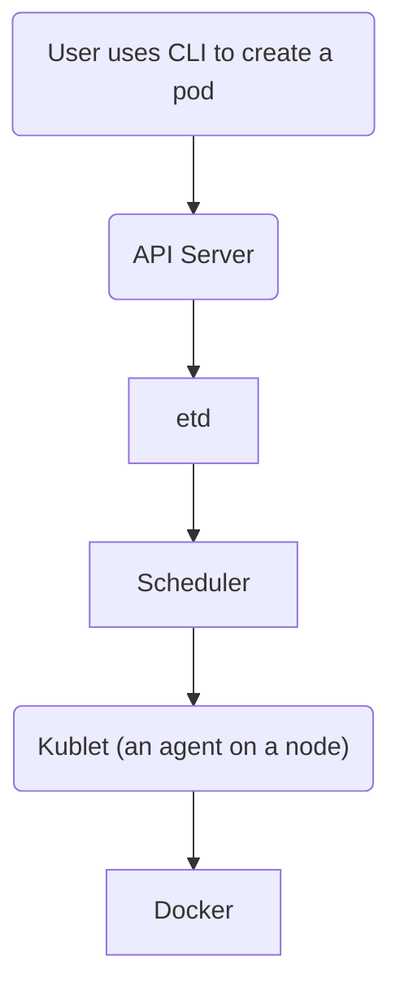

# Kubernetes
Kubernetes is a tool for managing (e.g., deploying and scaling) containers. 

## Nodes
**Master**  
Text goes here. 

**Worker**  
Text goes here. 

## API Objects
**Pod**  
A pod is a collection of containers. 

**Deployment**  
A "deployment" is used to manages pods. 

**Service**  
A service is a network endpoint.

