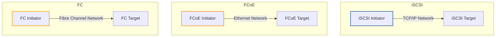

# Storage
* [Data Types](#data-types)
* [Storage Types](#storage-types)
* [File Sharing Protocols](#storage-protocols)
* [Storage Area Network](#storage-area-network)
* [Storage Area Network Protocols](#storage-area-network-protocols)
* [RAID Configurations](#raid-configurations)

## Data Types
### Structured Data  
Structured data follows a schema. A *schema* defines field data types, field formats, and relationships between tables. It also requires all records in a table to have the same fields. It’s hard to change a schema after it’s created without having a negative impact. 

### Semi-Structured Data
Semi-structured data is defined using tags. They look like dictionaries (e.g., JSON, XML, and graph data). New fields can be added without having a negative impact on existing data. 

### Unstructured Data
Unstructured data is data that does not use a schema or tags. Some examples are images, audio files, video files, email, and Microsoft Office documents. An instance of unstructured data is called a Binary Large Object (BLOB) or blob. Blobs account for most of the world’s data. 

## Storage Types
**Database**  
Database dumps are used to export database information without rebooting the server. 
* Structured data: SQL databases
* Semi-structured data: NoSQL databases
  * Document
  * Key-value
  * Wide Column
  * Graph Stores

**File**  
File-based storage solutions organize data using file systems (e.g., NTFS and UFS). 
* Semi-structured data: CSV, XML, JSON
* Unstructured data: Microsoft Office Documents

**Object**  
Object-based storage solutions organize data using metadata tags. They are used for unstructured data that are written once and read infrequently. The unit of storage used to house an object is called a "bucket." Write Once Read Many (WORM) technology stores data in a way so it can't be modified. 
* Unstructured data: images, programs

**Block**  
Block-based storage solutions organize data into blocks that can be divided, stored across multiple storage devices, and reassembled. They are used in Storage Area Networks (SANs), very efficient at handling large data sets, and very *expensive*. 
* Unstructured data: virtual machines

## File Sharing Protocols
File sharing is misnomer. You don't share individual files. You share folders. 

**Network File System**  
The `/etc/export` file is used to identify which folders to share via the Network File System (NFS). 

**Common Internet File System**  
The Common Internet File System (CIFS) is an alternative to the NFS. 

**Server Message Block**  
The Server Message Block (SMB) protocol is Microsoft's implementation of CIFS. SMB interfaces with the local filesystem (e.g. NTFS) for ACL lookups. 
* If you look at the properties of a folder and click the "Sharing" tab, you're about to configure SMB settings. 
* If you click the "Security" tab, you're about to configure NTFS settings. 

## Storage Area Network
A Storage Area Network (SAN) is made of three components.

**Data Store**  
Local and/or remote storage media waiting to execute SCSI or NVMe commands. 
* Local: uses Fibre Channel (FC)
* Remote: uses Fibre Channel over Ethernet (FCoE)

**Network**  
Connects the server to the data store.

**Server**  
Manages the data store using SCSI or NVMe commands. 

### Storage Area Network Protocols
**Fibre Channel**  
FC is a protocol used for transferring data over optical media within networks using FC cables and switches. 

**Fibre Channel over Ethernet**  
FCoE is a protocol used for transferring data within Ethernet networks. 

**Internet Small Computers Systems Interface**  
Internet Small Computers Systems Interface (iSCSI) is an used for transferring data within or between TCP/IP networks. 

## RAID Array Configurations
| RAID Array Types | Disks Required | Data                           | Parity                     | 
| ---------------- | -------------- | ------------------------------ | -------------------------- | 
| 0                | 2              | Striped across disks           | None                       | 
| 1                | 2              | Mirrored between disks         | None                       | 
| 5                | 3              | Striped across disks           | Striped across disks       | 
| 6                | 4              | Striped across disks           | Striped across disks twice | 
| 10               | 4              | Mirrored between two disk sets | None                       |  