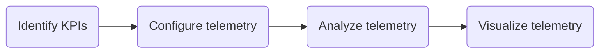

# Cloud Monitoring
Cloud monitoring is used to detect changes, errors, failures, and threats to a cloud's reliability and availability. It is automated observation and depends on telemetry, or the remote measurement of variables. A monitoring system usually waits for an app to do something (e.g., respond to a request) and then measures the service level observed. 

## Telemetry
In cloud administration, reliability and availability are measured using [metrics](/cloud/monitoring/README.md#metrics), logs, and traces. Each of these can be thought of as different types of measurements. 

> *One goal of dashboard design to make uninterested people interested in a system's performance.*

### Metrics
Metrics are measurements of performance and represent the state of a service. The metrics an organization chooses to collect are based on what is most important to their users and/or customers.

**Business Metrics**   
Text goes here. 

**Operational Metrics**  
Operational metrics measure the performance and the stability of a system. Below are some examples.
* Latency: response time
* Throughput: requests per minute
* Availability: percent of time an app is responsive
* Utilization: percent of hardware use and/or idleness
* Error: number of errors
* Garbage Collector: the time and/or frequency required to reallocate memory

#### Indicators  
**Request Saturation Point**  
The level of service where wait times are unacceptable for clients. 

**Application Performance Index**  
Used to quantify and describe user satisfaction. Toleration is categorized using three zones. 
* If an app completes a task below or at specific level, the user is assumed to be satisifed. 
* If an app completes a task between a specific level and tolerable level, the user is assumed to be tolerating. 
* Any level above tolerable implies the user is frustrated. 

#### Correlations
A correlation is the comparison of two or more sets of metrics. 

**The USE Method**  
The USE method correlates the metrics listed below to measure performance. This technique was developed by Brendan Gregg, a software engineer from Oracle Corp. 
* Utilization: the difference between how often a resource is busy versus idle
* Saturation: the difference between the number of requests processed versus the number of requests that have not been processed yet
* Errors: the difference between handled and unhandled exceptions

**The RED Method**  
The RED method correlates the metrics listed below to measure performance. This technique is designed for microservice architectures. It was developed by Tom Wilkie, a software engineer from Grafana.  
* Rate: the number of requests processed during a given interval
* Errors: the number of failed requests
* Duration: the average time an app takes to respond to a request

#### Application Performance Monitors
[Application Performance Monitors (APMs)](/cloud/monitoring/apm.md) are used to provide high-level and customer-oriented metrics. Below are some examples. 
* 5-star ratings
* Service abandonments (the time difference between a customer giving up before an app provides a service)
* Logon frequency 

### Logs
A log is a table of data used to record an event. A log can be generated using multiple [metrics](/cloud/monitoring/README.md#metrics). For example, a log of process execution would consist of the following [metrics](/cloud/monitoring/README.md#metrics):
* Resource usage
* Duration
* Concurrency information

**Auditable Logs**  
Logs are auditable when they allow you to analyze the operation of a system. Auditable logs must include the properties listed below. 
| Property                                  | Example           | 
| ----------------------------------------- | ----------------- |
| Activity time                             | 2023-10-13 11:16  |
| Activity category                         | Logon             |
| The identity of the activity owner        | cyberphor         |
| Names of objects affected by the activity | Domain Controller |
| Activity result                           | Successful        |

**Log Management Systems**  
Log management systems are used to manage log access and life cycles. Log management systems also perform the tasks listed below. 
* Normalization
* Correlation
* Reporting

**Logging Use Cases**  
Below is a list of use cases for logging. 
* Root Cause Analysis (RCA)
* A/B testing to make decisions
* Business Intelligence 
* User & Entity Behavior Analytics (UEBA)
* Monitoring and Alerting
* Compliance Auditing

### Traces
Traces used multiple logs describe a chain of events across a system. Below is an example.
1. A client submits a request to the Azure Kubernetes Service (AKS)
2. The request is ingested by an Ingestion Service
3. The Ingestion Service puts the request on a Service Bus
4. The Service Bus sends the request to a Workflow Service
5. The Worfklow Service sends the request to a delivery service, drone scheduler, and package service

**Tracing Activity Within a Microservice Architecture**  
Use APMs designed for microservices (e.g., [Prometheus](/theory/cloud/monitoring/apm.md#prometheus)). Traditional APMs are meant for monolithic apps. Microservices are difficult to monitor because every service is an app unto itself. They also generate more observable activity (e.g., service discovery and replication). 

## Mitigation Stategies
Problems discovered through cloud monitoring can be mitigated using reactive or proactive strategies. 

### Reactive Strategies
**Use a Ticketing System**  
A ticketing system allows an administrator to manage problems using information such as priority and available resources. It can also be configured to automatically assign a ticket when there is an alert. 
A ticketing system can be developed using the steps described below. 
1. Define what events are adverse
2. Define what is urgent, non-urgent, important, and not important
3. Define the level of authority required to respond
4. Define who is able and available to respond when there is an adverse event

**Use Key Performance Indicators**  
Key Performance Indicators (KPIs) are metrics used to identify when something is about to or has gone wrong. They trigger warnings and alerts. Below is a list of common KPIs to monitor. 
* Time required to enter data into a form
* The correlation between items in a catalog and number of purchases made
* Mean Time to Detect (MTTD)
* Mean Time to Resolve (MTTR)

**Use Availability Tests**   
Availability tests are used to check if an app is responding as expected. 

### Proactive Strategies
**Promote Continous Improvement**  
Continous improvement is represented by the principles listed below. 
* Be the best, not better
* Avoid upheaval using small and frequent changes
* Understand the system before hunting for the root cause of a failure
* Treat performance issues as security issues 

**Use Scaling**  
Scaling is the process of adjusting infrastructure to meet changes in demand. Workloads in production are too unpredictable for manual scaling. The Azure Monitor service provides auto-scaling.

