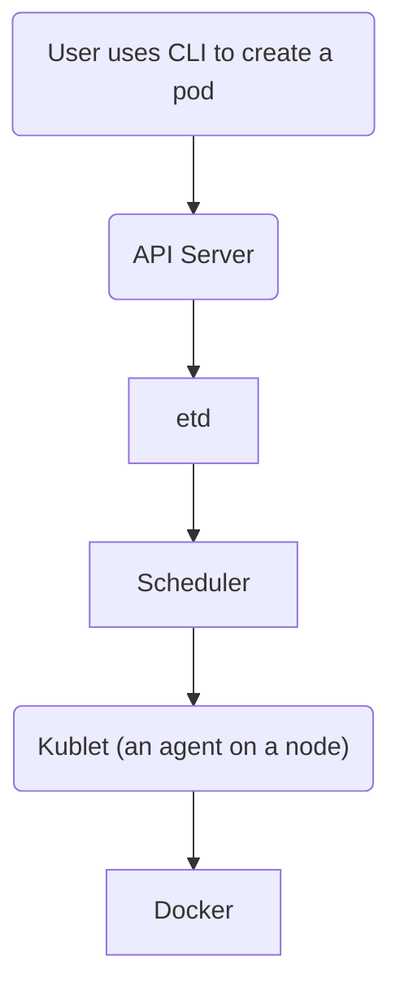

# Kubernetes
Kubernetes is a tool for managing (e.g., deploying and scaling) containers. 

## Nodes
**Master**  
Text goes here. 

**Worker**  
Text goes here. 

## API Objects
**Pod**  
A pod is a collection of containers. 

**Deployment**  
A "deployment" is used to manages pods. 

**Service**  
A service is a network endpoint.

## Exposing a Service
### East-to-West Traffic
**ClusterIP**  
Creates an internal IP address that is accessible by other pods. 

**NodePort**  
Exposes a service to external connections (on a given node) using a random TCP port from 3000 to 32767. Cannot load balance across nodes though. 

**LoadBalancer**  
A router provided by your Cloud Service Provider (not Kubernetes). Allows you to get a public IP address. Expensive. 

**ExternalName**  
Allows you to use an existing domain name. 